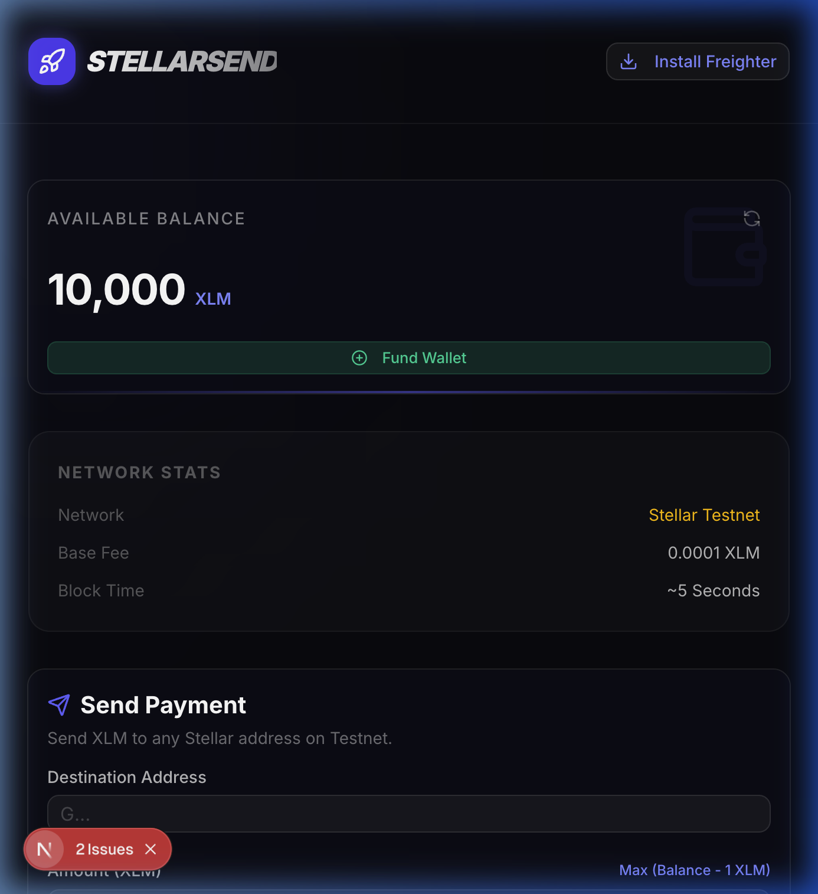
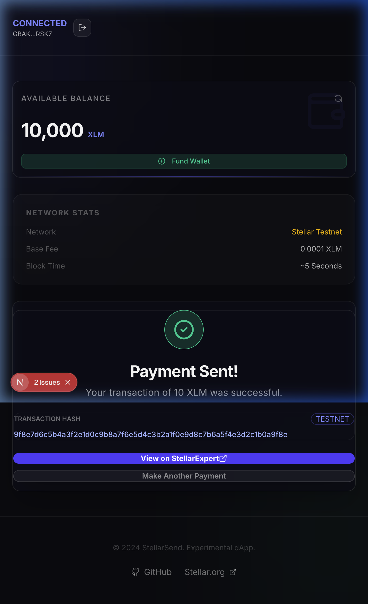

# StellarSend

StellarSend is a premium, high-speed dApp for sending XLM on the Stellar Testnet. Built with Next.js 14, TypeScript, and shadcn/ui, it offers a futuristic interface for global payments with real-time validation and seamless wallet integration.

## Project Description

StellarSend aims to provide a "Stellar" user experience for basic blockchain operations. It leverages the Freighter wallet for secure, client-side transaction signing and interfaces directly with the Stellar Horizon Testnet. Whether you are sending a standard payment or creating a new account, StellarSend handles the logic automatically, ensuring your transactions are processed efficiently.

### Key Features
- **Futuristic UI**: Glassmorphism design system with dark mode aesthetics.
- **Smart Logic**: Automatically switches between `payment` and `createAccount` based on destination existence.
- **Wallet-Centric**: Built for the **Freighter** extension ecosystem.
- **Developer Ready**: Full TypeScript support and CI/CD ready.

## Getting Started

### Prerequisites
- **Node.js**: Version 18.0.0 or higher.
- **Freighter Wallet**: [Install extension](https://www.freighter.app/) and set network to **Testnet**.

### Setup Instructions

1.  **Clone the repository**:
    ```bash
    git clone https://github.com/saasflare-online/stellarsend.git
    cd stellarsend
    ```

2.  **Install dependencies**:
    ```bash
    npm install
    ```

3.  **Environment Setup**:
    Copy the example environment file:
    ```bash
    cp .env.example .env.local
    ```

4.  **Run locally**:
    ```bash
    npm run dev
    ```
    Open [http://localhost:3000](http://localhost:3000) to view the app.

## Project Walkthrough

### 1. Wallet Connected & Balance
Once connected via Freighter, the app displays your truncated public key and live XLM balance fetched from the Testnet.



### 2. Transaction Results
After submitting a payment, the app provides real-time feedback. Green indicators signify a successful ledger entry with a direct link to the transaction explorer.



## Technology Stack
- **Framework**: Next.js 14 (App Router)
- **Stellar SDK**: `@stellar/stellar-sdk` & `@stellar/freighter-api`
- **Styling**: TailwindCSS & shadcn/ui
- **Icons**: Lucide React

## License
MIT License. See [LICENSE](LICENSE) for more information.
